# Capstone Project: E-Commerce Platform Deployment with Git, Linux, and AWS

## ✅ Project Objective
Deploy and manage an e-commerce website named **MarketPeak** using:
- **Git** for version control  
- **Linux & Apache** for hosting  
- **AWS EC2** for deployment  
- A **CI/CD workflow** for testing and deploying updates  

---

## 🧱 1. Git Setup and Local Preparation
- Created project directory: `MarketPeak_Ecommerce`
```bash
mkdir MarketPeak_Ecommerce
cd MarketPeak_Ecommerce
```
- Initialized Git repo: `git init`
- Downloaded and extracted a free e-commerce template from [Tooplate](https://www.tooplate.com/view/2130-waso-strategy#google_vignette)
* Customized content and committed changes to Git:
```bash
git add .
git config --global user.name "YourUsername"
git config --global user.email "youremail@example.com"
git commit -m "Initial commit with basic e-commerce site structure"
```

Create a repo on github
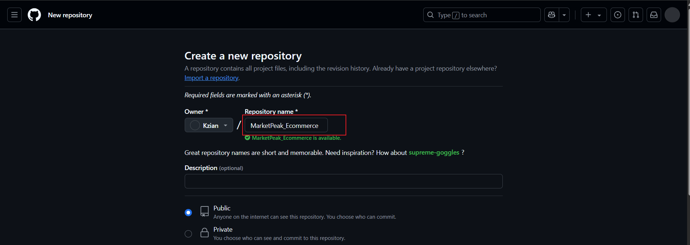
* Pushed the code to GitHub:
```bash
git remote add origin https://github.com/your-git-username/MarketPeak_Ecommerce.git
git push -u origin main
```

---

## ☁️ 2. EC2 Server Deployment
- Launched EC2 instance with Amazon Linux 2
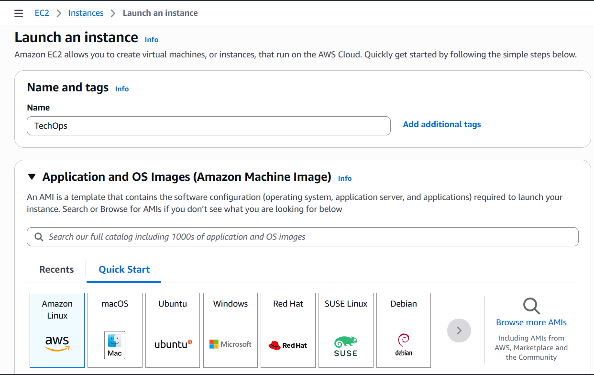
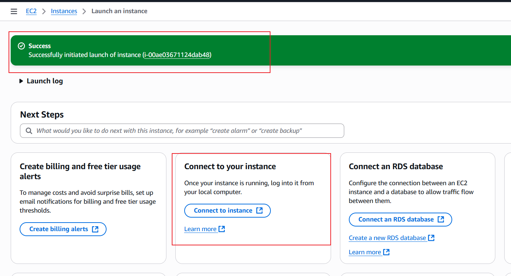
- Connected via SSH: `ssh -i "linuxkey.pem" ec2-user@ec2-3-89-125-211.compute-1.amazonaws.com`
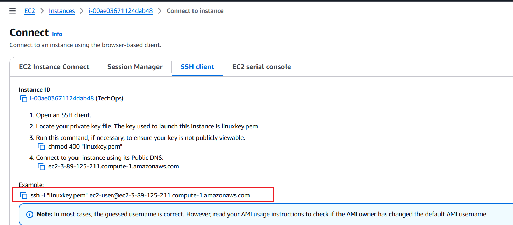
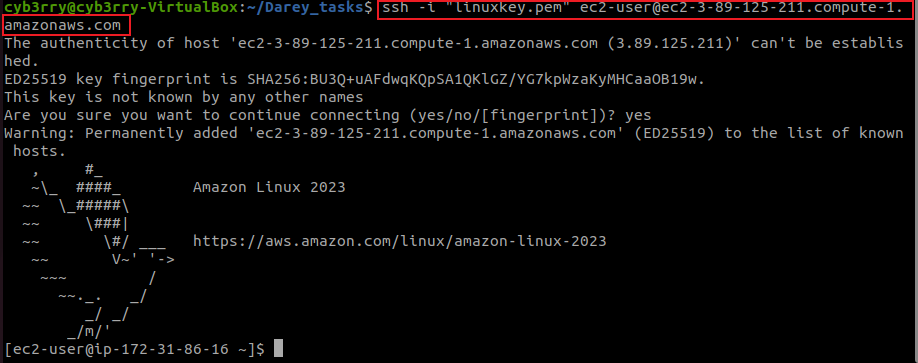
- Installed Apache:
  ```bash
  sudo yum install httpd -y
  sudo systemctl start httpd
  sudo systemctl enable httpd
  ```
  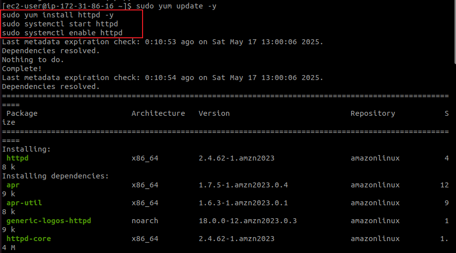
- Generated SSH keys and added the public key to GitHub for authentication
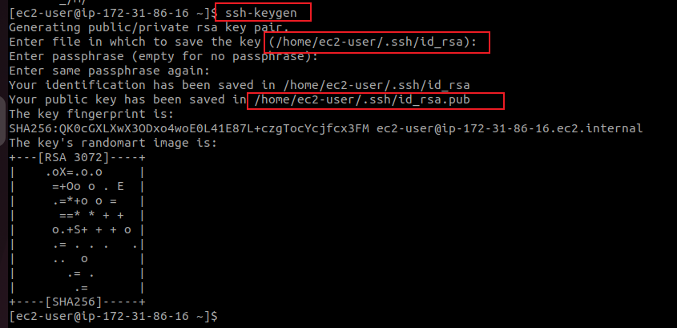
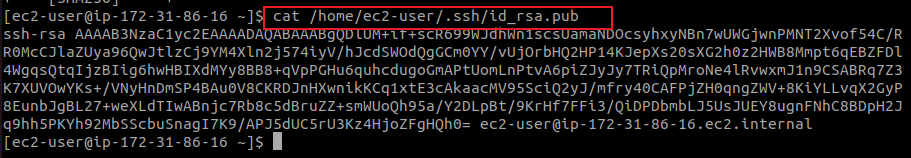
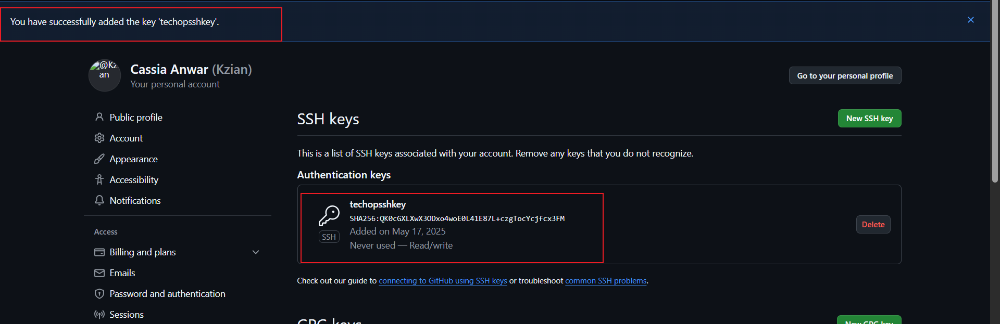
- Cloned project repository via SSH into the EC2 instance
```bash
git clone git@github.com:yourusername/MarketPeak_Ecommerce.git
```

- Deployed the site to Apache's web root:
  ```bash
  sudo rm -rf /var/www/html/*
  sudo cp -r ~/MarketPeak_Ecommerce/* /var/www/html/
  sudo systemctl reload httpd
  ```
  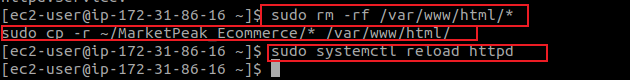
  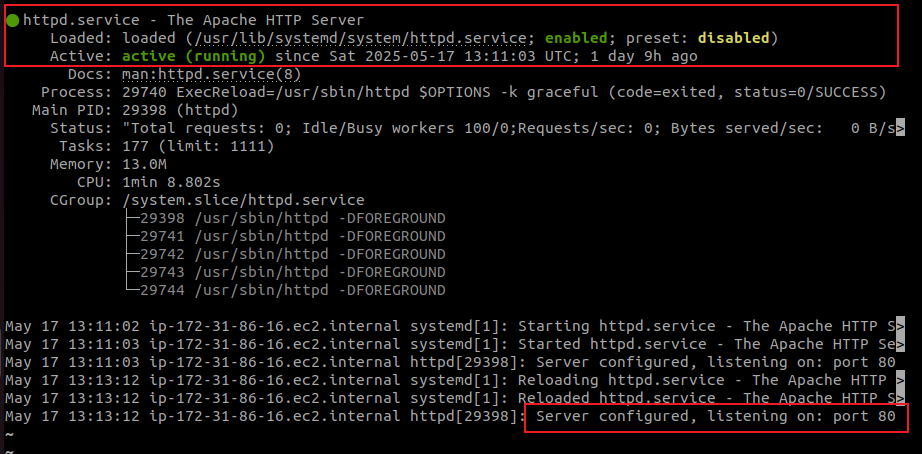
- Configured EC2 security group to allow HTTP (port 80) traffic
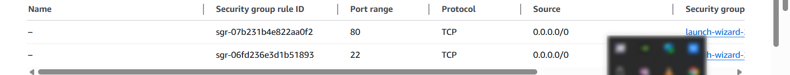
- Successfully accessed the website via **EC2 public IP**


---

## 🔁 3. Git Branching and CI/CD Workflow
- Created and used a `development` branch for updates:
  ```bash
  git branch development
  git checkout development

  ```
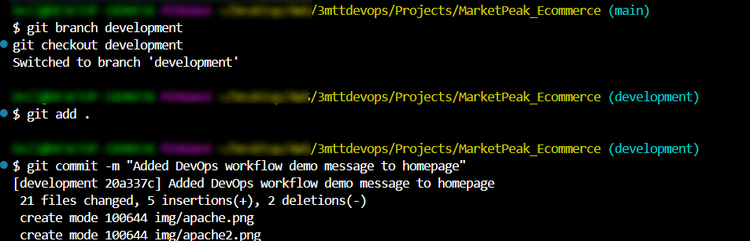
- Made updates, committed changes, and pushed to GitHub
-  Committed and pushed the changes to GitHub:

  * `git add .`
  * `git commit -m "Add new features or fix bugs"`
  * `git push origin development`
* Merged development branch into `main` via GitHub pull
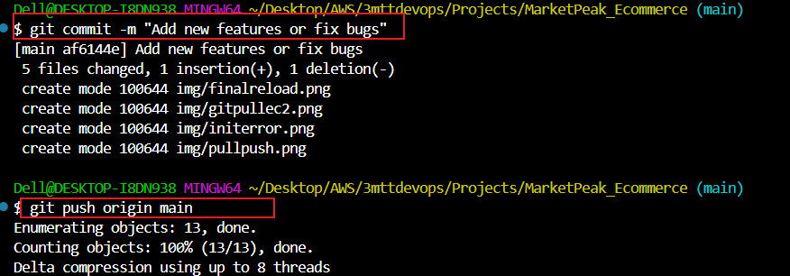

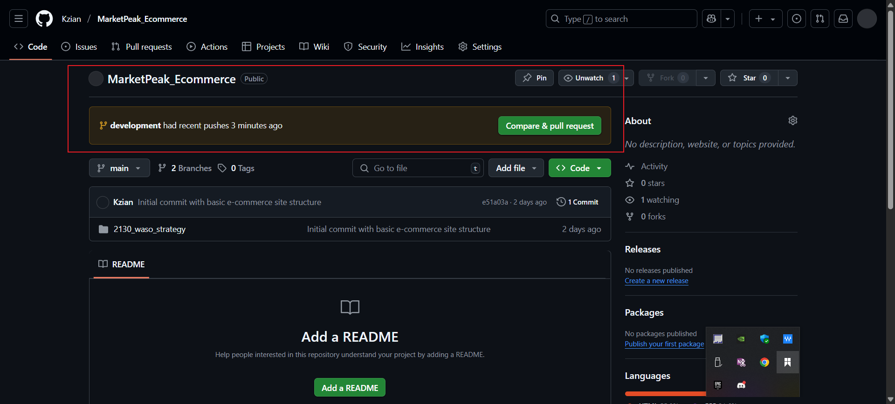
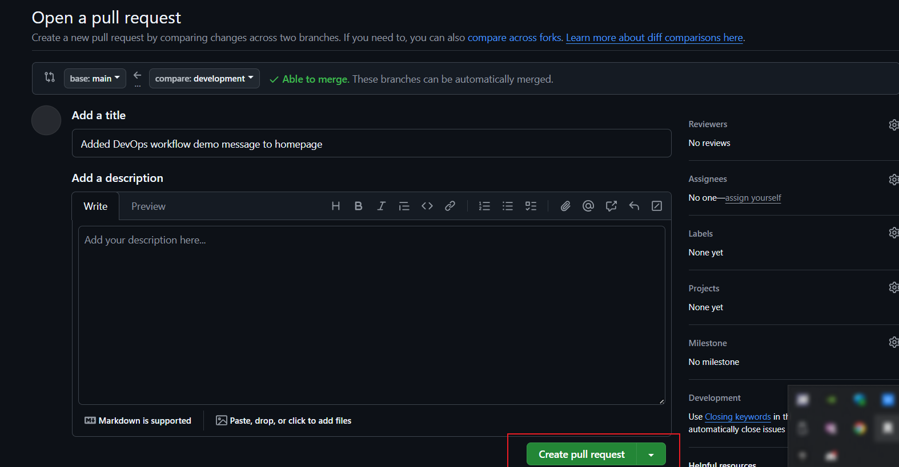
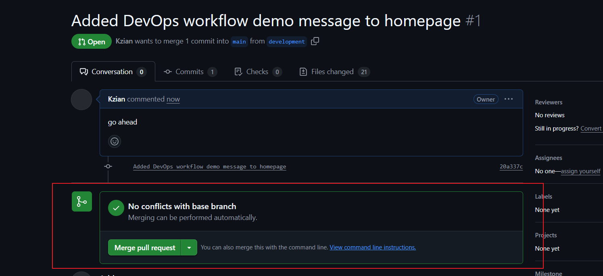
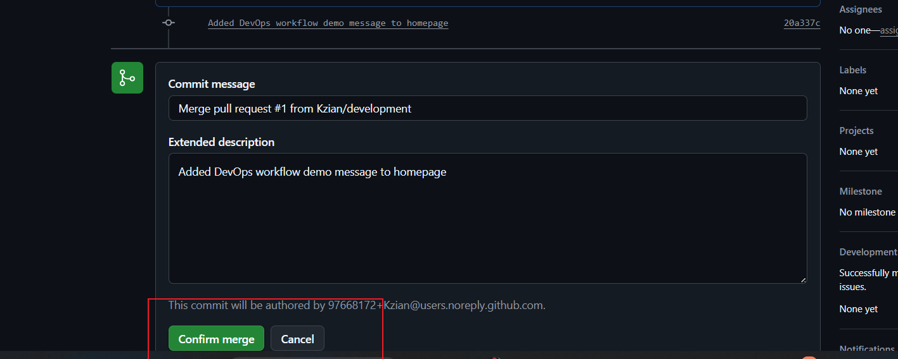
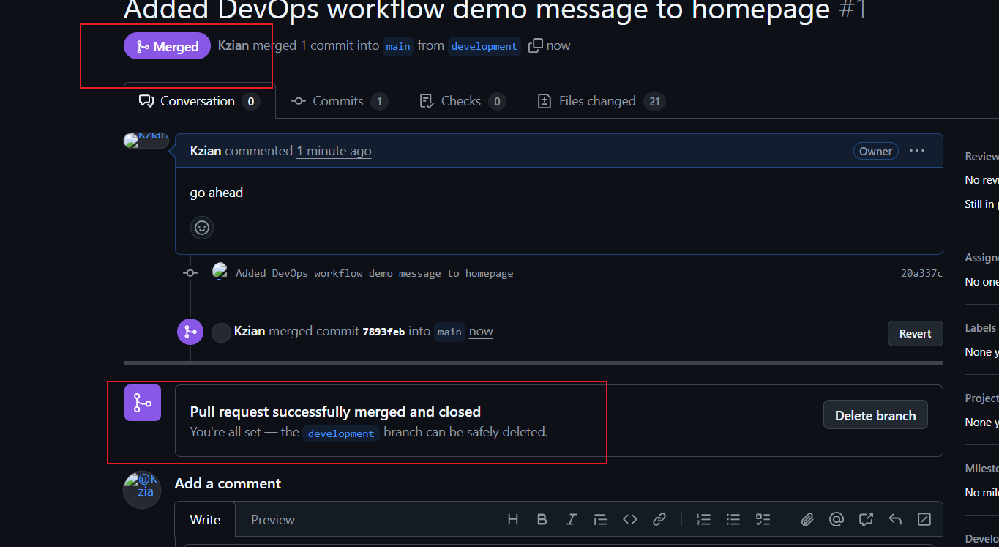


Pulled latest changes into EC2 server:

  * `cd /var/www/html/`
  * `git pull origin main`
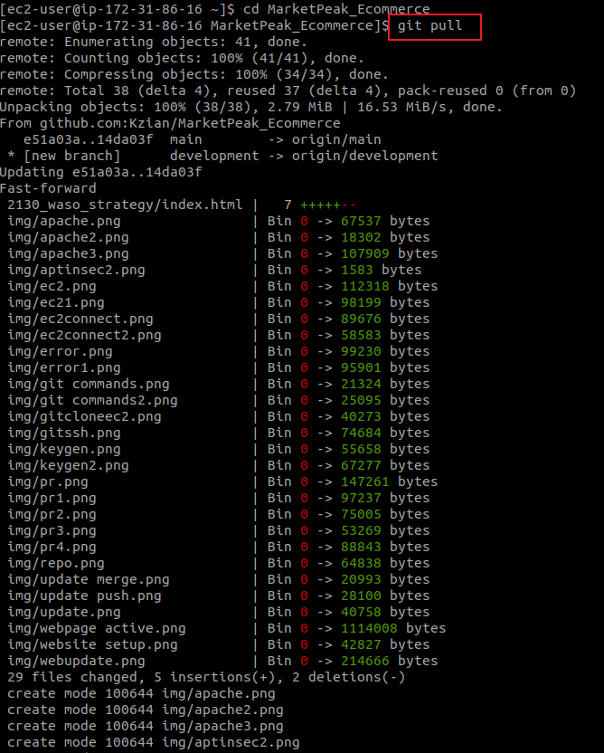
* Reloaded Apache: `sudo systemctl reload httpd`
* Verified that updates were live via browser


---

## ❗️ Errors Encountered & How They Were Solved

| ❌ Error | 🛠️ Solution |
|--------|------------|
| **`bash: git@github.com:...: No such file or directory`** | Occurred due to running the repo URL directly as a command instead of using `git clone git@github.com:...` |
| **`sudo: apt: command not found`** | EC2 used Amazon Linux which uses `yum`, not `apt`. Used `sudo yum install` instead. |
| **Unable to access site via browser** | Apache worked locally (`curl http://localhost`) but port 80 was **not open** in EC2 security group. Added HTTP rule in AWS console (`Anywhere - IPv4`). |
| **Accidentally removed SSH (port 22)** while editing security group | Re-added a rule to allow port 22 from `My IP` to restore SSH access. |
| **Website showed default “It works!” page** | Found project files were copied into a subdirectory (`/var/www/html/2130_waso_strategy`). Moved content into `/var/www/html/` directly. |
| **Changes didn’t appear after `git pull`** | Confirmed pull was done in `/var/www/html/` and reloaded Apache with `sudo systemctl reload httpd` to apply updates. |
| **Browser cached old version of site** | Resolved by clearing cache or opening in incognito mode. |

---
## MISCELLANEOUS
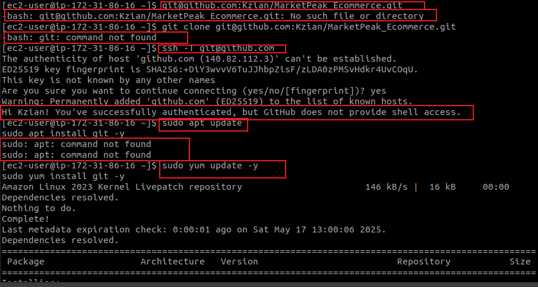
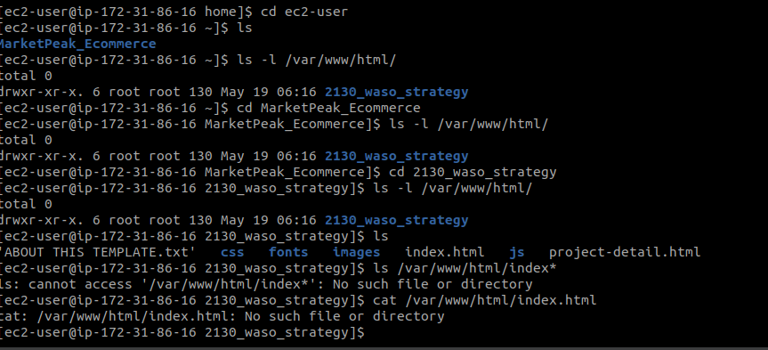
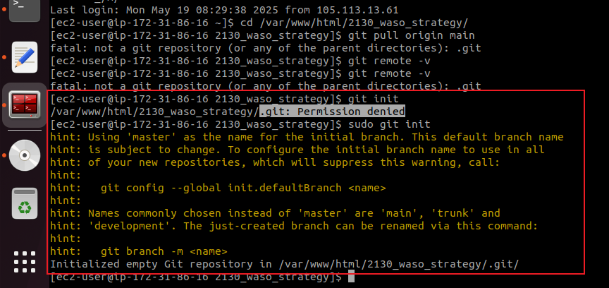
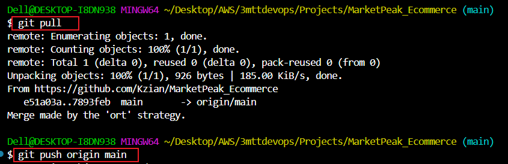
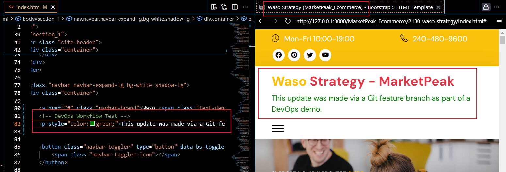

## 🧪 Current Status
- Website is **live and accessible** via EC2 public IP
- GitHub is the **source of truth**
- Updates are deployed via **Git pull + reload** from `main` branch
- Ready to implement **CI/CD automation**
